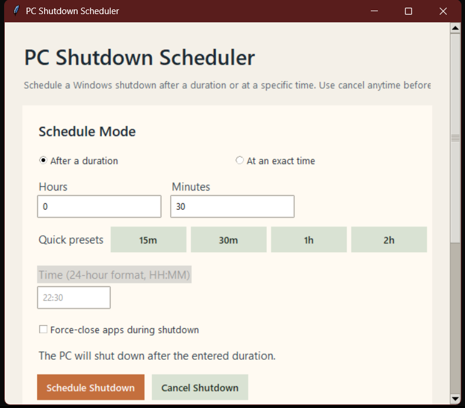

# PC Shutdown Scheduler -@EddieCodes

A simple Windows desktop app that lets you schedule a PC shutdown with a clean Tkinter UI.

## 📸 Screenshot



## Features

- Schedule shutdown after a duration
- Schedule shutdown at an exact time in `HH:MM` format
- Quick presets for common delays
- Optional force-close for running apps
- Live countdown display
- One-click shutdown cancellation

## Run

From this folder:

```powershell
python app.py
```

Or double-click `run.bat`.

## Notes

- This app is Windows-only because it calls the built-in `shutdown` command.
- If you schedule another shutdown, the app first clears any earlier pending shutdown request.
- Exact-time mode automatically uses tomorrow if the chosen time has already passed today.

## Good Next Features

- Restart, log off, sleep, and hibernate actions
- Reminder popup 5 minutes before shutdown
- Minimize-to-tray support
- Save favorite presets
- Daily shutdown routine mode
